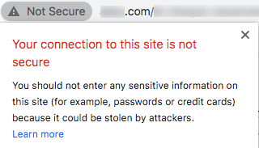

# SSL 인증서 요청 프로세스

전자 메일을 보내기 위해 Adobe에 도메인을 위임하면([도메인 이름 설정](/help/additional-resources/ac-domain-name-setup.md) 참조) Adobe에서 특정 기능에 대한 특정 하위 도메인을 만들고 사용합니다.

예를 들어 이메일 전송을 위해 *email.example.com*&#x200B;을 Adobe에 위임한 경우 Adobe은 다음과 같은 하위 도메인을 만듭니다.
* *t.email.example.com*  - 추적 링크
* *m.email.example.com*  - 미러 페이지용
* *res.email.example.com*  - 호스팅된 리소스(예: 이미지)

SSL(HTTPS)**을 통해 이러한 도메인을 보호하는 것이 좋습니다.** 사실, 보안되지 않은 링크(HTTP)는 차단에 취약하며 현재 브라우저에 경고를 표시합니다.

이러한 하위 도메인에 SSL 인증서를 설치하려면 CSR 파일을 요청하고 나중에 설치 또는 갱신하기 위해 Adobe용 SSL 인증서를 구입하는 과정이 포함됩니다.

>[!CAUTION]
>
>SSL 인증서를 설치하기 전에 [이 페이지](https://experienceleague.adobe.com/docs/control-panel/using/subdomains-and-certificates/renewing-subdomain-certificate.html#installing-ssl-certificate)에 나열된 사전 요구 사항을 알고 있는지 확인하십시오.
>
>Adobe은 최대 2048비트 인증서만 지원합니다. 4096비트 인증서는 아직 지원되지 않습니다.

## 용어 설명

| 용어 | 설명 |
|--- |--- |
| CA(인증 기관) | DigiCert, Symantec 등과 같은 ID를 확인한 후 조직 또는 개인에게 디지털 인증서를 발급하는 SSL 인증서 제공자.<ul><li>신뢰할 수 있는 CA는 일반적으로 루트 인증서를 발급하는 제3자 CA로 간주됩니다.</li><li>인증서를 사용하는 동일한 조직/회사에서 인증서를 서명하는 경우 자체 서명된 인증서와 같이 SSL 인증서가 있는 경우에도 신뢰할 수 없는 CA로 분류됩니다.</li></ul> |
| 체인 인증서 | 루트 인증서와 하나 이상의 중간 인증서가 포함된 인증서를 체인(또는 체인) 인증서라고 합니다. |
| CSR(인증서 서명 요청) | SSL 인증서를 적용할 때 인증 기관에 제공된 인코딩된 텍스트 블록입니다. 일반적으로 인증서가 설치된 서버에서 생성됩니다. |
| DER(고유 인코딩 규칙) | 인증서 확장 유형입니다. .der 확장명은 바이너리 DER 인코딩 인증서에 사용됩니다. 이러한 파일은 .cer 또는 .crt 확장명을 지원할 수도 있습니다. |
| EV(확장 유효성 검사) 인증서 | EV 인증서는 피싱 공격을 방지하기 위해 고안된 새로운 유형의 인증서입니다. 비즈니스 및 인증서를 주문한 사람의 장기간 검증 작업이 필요합니다. |
| 높은 보증 인증서 | 도메인 이름 및 유효한 비즈니스 등록을 확인한 후 CA에서 높은 보증 인증서를 발행합니다. |
| 중간 CA | 체인 인증서에 포함된 중간 인증서의 인증 기관. |
| 중간 인증서 | 인증 기관은 트리 구조의 형태로 인증서를 발행합니다. 루트 인증서는 트리의 맨 위에 있는 인증서입니다. 인증서와 루트 인증서 사이의 모든 인증서를 체인 또는 중간 인증서라고 합니다. |
| 저보증 인증서 | 도메인 유효성 검사 인증서라고도 하는 낮은 보증 인증서에는 인증서에 도메인 이름만 포함됩니다(비즈니스/조직 이름이 아니라). |
| PEM(개인 정보 보호 강화 메일) | ASCII(Base64) 데이터를 포함하는 .pem 확장자를 가진 인증서 이러한 인증서는 &quot; - - - - - - - - - -&quot; 행으로 시작합니다. |
| 루트 인증서 | 인증 기관은 트리 구조의 형태로 인증서를 발행합니다. 루트 인증서는 트리의 맨 위에 있는 인증서입니다. |
| SAN(주체 대체 이름) | 주체 대체 이름은 추가 호스트 이름(사이트, IP 주소, 일반 이름 등)입니다. 단일 SSL 인증서의 일부로 서명되어야 합니다. |
| 자체 서명 인증서 | 신뢰할 수 있는 인증 기관이 아닌 이 인증서를 만드는 사람이 서명한 인증서. 자체 서명된 인증서는 CA에서 서명한 인증서와 동일한 수준의 암호화를 활성화할 수 있지만 두 가지 주요 단점이 있습니다.<ul><li>방문자의 연결은 침입자가 보낸 모든 데이터를 볼 수 있도록 하여(따라서 연결 암호화 목적을 무산시킵니다)</li><li> 신뢰할 수 있는 인증서처럼 인증서를 해지할 수 없습니다.</li></ul> |
| SSL(Secure Sockets Layer) | 웹 서버와 브라우저 간에 암호화된 링크를 설정하는 표준 보안 기술입니다. |
| 와일드카드 인증서 | 와일드카드 인증서는 *.adobe.com과 같은 단일 도메인 이름에 대해 1차 수준 하위 도메인을 무제한으로 보호할 수 있습니다. |

## 기본 단계

1. CSR(Certificate Signing Request) 파일을 요청하고 필요한 정보(국가, 주, 도시, 조직 이름, 조직 단위 이름 등)를 제공합니다. 를 Adobe에 추가합니다.
1. Adobe으로 생성된 CSR 파일의 유효성을 확인하고 제공한 모든 정보가 올바른지 확인합니다.
1. 신뢰할 수 있는 인증 기관<!--taking care of asking for using the subjectAltName SSL extension (SAN) if it is for several domain names, and get/purchase the resulting certificate (ideally) in PEM format for Apache server-->에서 서명한 인증서를 생성하려면 CSR 세부 정보를 사용하십시오.
1. SSL 인증서의 유효성을 확인하고 CSR과 일치하는지 확인합니다.
1. SSL 인증서를 설치할 Adobe에 제공합니다.
1. 각 보안 하위 도메인에 대해 SSL 인증서가 성공적으로 설치되었는지 테스트합니다.
1. SSL 인증서 유효 기간을 모니터링합니다.
1. Adobe Campaign에서 특정 구성을 업데이트합니다.

## 세부 프로세스

### 전제 조건

도메인 이름과 함수(추적, 미러 페이지, 웹 앱 등)를 식별해야 합니다. 보안 설정
>[!NOTE]
>
>Adobe은 도메인 이름과 관련 기능을 정의하는 데 도움이 될 수 있습니다. 자세한 내용은 Adobe 고객 성공 관리자에게 문의하십시오.

### 1단계 - CSR 파일 가져오기

CSR(Certificate Signing Request) 파일을 얻으려면 아래 절차를 따르십시오.

* [Campaign 컨트롤 패널](https://experienceleague.adobe.com/docs/control-panel/using/control-panel-home.html)에 액세스할 수 있는 경우 [이 페이지](https://experienceleague.adobe.com/docs/control-panel/using/subdomains-and-certificates/renewing-subdomain-certificate.html#subdomains-and-certificates)의 지침에 따라 Campaign 컨트롤 패널에서 CSR 파일을 생성하고 다운로드합니다.

* 그렇지 않은 경우 https://adminconsole.adobe.com/을 통해 지원 티켓을 만들어 필요한 하위 도메인에 대한 Adobe 고객 지원 센터에서 CSR 파일을 받습니다.

다음은 따라야 할 몇 가지 우수 사례입니다.

* 위임된 하위 도메인당 하나의 요청을 발생시킵니다.
* 여러 하위 도메인을 단일 CSR 요청으로 결합할 수 있지만 동일한 환경 내에서만 가능합니다. 예를 들어 Campaign Classic에서 마케팅 서버, [mid-sourcing 서버](https://experienceleague.adobe.com/docs/campaign-classic/using/installing-campaign-classic/additional-configurations/mid-sourcing-server.html) 및 [실행 인스턴스](https://experienceleague.adobe.com/docs/campaign-classic/using/transactional-messaging/instance-configuration/creating-a-shared-connection.html)은 3개의 개별 환경입니다.
* SSL 인증서 갱신에 앞서 새 CSR을 발급받아야 합니다. 1년 이전의 이전 CSR 파일을 사용하지 마십시오.

다음 정보를 제공해야 합니다.

>[!CAUTION]
>
>아래 표에 표시된 모든 필드는 반드시 채워야 합니다. 그렇지 않으면 CSR 요청을 처리할 수 없습니다.

**Adobe 팀의 지원을 제공하는 정보:**

| 제공하는 정보 | 값 예 | 참고 |
|--- |--- |--- |
| 클라이언트 이름 | My Company Inc. | 조직의 이름입니다. 이 필드는 요청을 추적하기 위해 Adobe에서 사용합니다(CSR/SSL 인증서에 포함되지 않음). |
| Adobe Campaign 환경 URL | https://client-mid-prod1.campaign.adobe.com | Adobe Campaign 인스턴스 URL. |
| 일반 이름 [CN] | t.subdomain.customer.com | 관련 도메인이 될 수 있지만 일반적으로 추적 도메인입니다. |
| 주체 대체 이름 [SAN] | t.subdomain.customer.com | 추적 하위 도메인을 SAN으로 포함해야 합니다. |
| 주체 대체 이름 [SAN] | m.subdomain.customer.com |
| 주체 대체 이름 [SAN] | res.subdomain.customer.com |

**IT/SSL 내부 팀이 제공하는 정보:**

| 제공하는 정보 | 값 예 | 참고 |
|--- |--- |--- |
| 국가 [C] | 미국 | 2자 코드여야 합니다. 전체 국가 목록 [여기](https://www.ssl.com/csrs/country_codes/)에 액세스합니다. *참고:영국에서는 GB(영국 아님)를 사용합니다.* |
| 시/도 이름 [ST] | 일리노이 | 해당되는 경우. 값은 약어가 아닌 전체 이름이어야 합니다. |
| 구/군/시/도 이름 [L] | 시카고 |
| 조직 이름 [O] | ACME |
| 조직 단위 이름 [OU] | IT |

>[!NOTE]
>
>&quot;subdomain.customer.com&quot;을 위임된 하위 도메인으로 바꾸고, 다른 예제 값을 적절한 값으로 바꿉니다.

### 2단계 - CSR 파일 유효성 검사

Adobe은 관련 정보를 사용하여 요청을 제출한 후 CSR(Certificate Signing Request) 파일을 생성하고 제공합니다.

결과 CSR 파일의 텍스트는 **&quot;—BEGIN CERTIFICATE REQUEST—&quot;**&#x200B;로 시작해야 합니다.

Adobe에서 CSR 파일을 받으면 아래 절차를 따르십시오.

1. CSR 파일 텍스트를 복사하여 https://www.sslshopper.com/csr-decoder.html, <!--https://www.certlogik.com/decoder/,--> 또는 https://www.entrust.net/ssl-technical/csr-viewer.cfm과 같은 온라인 디코더에 붙여넣습니다.
또는 Linux 컴퓨터에서 로컬로 *OpenSSL* 명령을 사용할 수 있습니다. 자세한 내용은 [이 외부 페이지](https://www.question-defense.com/2009/09/22/use-openssl-to-verify-the-contents-of-a-csr-before-submitting-for-a-ssl-certificate)를 참조하십시오.
1. 모든 검사가 성공했는지 확인합니다.
1. 올바른 매개 변수와 도메인 이름이 포함되어 있는지 확인합니다.
1. 다른 모든 데이터가 요청을 제출할 때 제공한 세부 정보와 일치하는지 확인합니다.

### 3단계 - SSL 인증서 생성

CSR 파일이 제공되면 CSR 파일을 사용하여 해당 도메인에 대한 SSL 인증서를 구매하고 생성해야 합니다.

* SSL 인증서:
   * 는 Apache PEM 형식이어야 합니다.
   * 2048비트 이하여야 합니다.
   * 유효한 인증 기관(Certification Authority)을 통해 서명해야 합니다.
   * CSR 파일에 언급된 모든 SAN(Subject Alternative Names)을 포함해야 합니다.
* 하나 이상의 중간 인증서가 있는 경우 루트 인증서와 모든 중간 인증서를 Adobe에 제공해야 합니다.
* 모든 인증서 유효 기간을 설정할 수 있지만 Adobe은 이를 충분히 길게(예: 2년) 선택할 것을 권장합니다.

>[!NOTE]
>
>자체 내부 도구 또는 CA가 제공하는 포털을 사용하여 인증서를 요청하는 경우 CSR 요청과 동일한 세부 정보를 사용하여 인증서 생성 프로세스의 지연 또는 불일치를 방지하십시오.

### 4단계 - SSL 인증서 유효성 검사

SSL 인증서가 생성되면 Adobe에 보내기 전에 SSL 인증서의 유효성을 확인해야 합니다. 이렇게 하려면 아래 절차를 따르십시오.

1. 인증서의 확장명이 .pem인지 확인합니다. 그렇지 않은 경우 PEM 형식으로 변환하십시오. *OpenSSL*&#x200B;을 사용하여 변환할 수 있습니다.
1. 인증서가 **&quot;—BEGIN CERTIFICATE—&quot;**&#x200B;로 시작되는지 확인합니다.
1. https://www.sslshopper.com/certificate-decoder.html 또는 https://www.entrust.net/ssl-technical/csr-viewer.cfm과 같은 온라인 디코더에 인증서 텍스트를 복사합니다.
또는 Linux 컴퓨터에서 로컬로 *OpenSSL* 명령을 사용할 수 있습니다. 자세한 내용은 [이 외부 페이지](https://www.shellhacks.com/decode-ssl-certificate/)를 참조하십시오.
1. 공용 이름, SAN, 발급자 및 유효성 기간을 포함하여 인증서가 올바르게 확인되는지 확인하십시오.
1. SSL 인증서 확인에 성공하면 인증서가 [이 웹 사이트](https://www.sslshopper.com/certificate-key-matcher.html)를 사용하여 CSR과 일치하는지 확인합니다.**CSR과 인증서 일치**&#x200B;를 선택하고 해당 필드에 인증서 및 CSR을 입력합니다. 그들은 필적이어야 한다.

### 5단계 - SSL 인증서 설치 요청

* [Campaign 컨트롤 패널](https://experienceleague.adobe.com/docs/control-panel/using/control-panel-home.html)에 액세스할 수 있는 경우 [이 페이지](https://experienceleague.adobe.com/docs/control-panel/using/subdomains-and-certificates/renewing-subdomain-certificate.html#installing-ssl-certificate)의 지침에 따라 Campaign 컨트롤 패널에 인증서를 업로드합니다.

* 그렇지 않은 경우 Adobe 서버에 인증서를 설치하기 위해 Adobe을 요청하려면 https://adminconsole.adobe.com/을 통해 다른 지원 티켓을 만드십시오.

다음을 제공해야 합니다.

* 인증서 파일, 루트 인증서 및 중간 인증서(티켓에 첨부됨)이며 Apache PEM 형식입니다.
* CSR에 대해 발생한 이전 지원 티켓 수입니다.
* CSR 티켓에 대해 제공된 것과 동일한 데이터(일반 이름, 인스턴스 URL, 주, 시/지역, 조직 이름, 조직 단위 이름 등).

### 6단계 - SSL 인증서 설치 테스트

SSL 인증서가 설치 및 Adobe 고객 지원 센터에서 확인되면 모든 URL에 대해 성공적으로 설치되었는지 확인합니다.

SSL 설치 티켓을 닫기 전에 아래 테스트를 수행합니다. 또한 [이 섹션](#update-configuration)에 설명된 대로 특정 구성을 업데이트해야 합니다.

브라우저에서 다음 URL로 이동합니다(&quot;subdomain.customer.com&quot;을 하위 도메인으로 바꾸기).

* https://subdomain.customer.com/r/test (a0/>웹 응용 프로그램](https://experienceleague.adobe.com/docs/campaign-classic/using/designing-content/web-applications/about-web-applications.html) 하위 도메인에만 해당 - 이메일 하위 도메인에는 적용되지 않음)[
* https://t.subdomain.customer.com/r/test
* https://m.subdomain.customer.com/r/test
* https://res.subdomain.customer.com/r/test

결과가 성공하면 환경 정보가 표시되고 URL의 주소 표시줄에 연결이 안전하다는 내용이 표시됩니다. 예를 들어 Google Chrome에서 다음 메시지를 볼 수 있습니다.

SSL 인증서가 제대로 설치되지 않으면 다음 경고가 표시됩니다.

### 7단계 - 인증서 유효 기간 확인

브라우저에서 인증서의 유효 기간을 확인할 수 있습니다. 예를 들어 Google Chrome에서 **보안** > **인증서**&#x200B;를 클릭합니다.

유효기간을 확인하는 것은 너의 책임이다. Adobe에서는 인증서 만료 모니터링 프로세스를 구현할 것을 권장합니다. SSL 인증서가 [이 문서](https://www.thesslstore.com/blog/what-happens-when-your-ssl-certificate-expires/)에서 만료될 때 발생하는 사항에 대해 자세히 알아보십시오.

* 인증서 만료 날짜 최소 2주 전에 업데이트된 인증서를 요청하는 지원 티켓을 만듭니다. CSR 세부 정보가 변경되지 않는 한 추가 CSR을 요청할 필요가 없습니다.

* [Campaign 컨트롤 패널](https://experienceleague.adobe.com/docs/control-panel/using/control-panel-home.html)에 액세스할 수 있고, AWS 환경의 Adobe에 의해 환경이 호스팅되는 경우, Campaign 컨트롤 패널을 사용하여 인증서가 만료되기 전에 인증서를 갱신할 수 있습니다. [이 섹션](https://experienceleague.adobe.com/docs/control-panel/using/subdomains-and-certificates/monitoring-ssl-certificates.html#monitoring-certificates)에서 자세히 알아보십시오.

### 8단계 - 특정 구성 {#update-configuration} 업데이트

요청된 SSL 인증서가 제대로 설치되면 Adobe Campaign의 모든 참조를 HTTP에서 HTTPS로 업데이트할 수 있습니다.

>[!NOTE]
>
>Campaign Classic의 경우 업데이트할 URL은 주로 [배포 마법사](https://experienceleague.adobe.com/docs/campaign-classic/using/installing-campaign-classic/initial-configuration/deploying-an-instance.html#deployment-wizard) 및 [외부 계정](https://experienceleague.adobe.com/docs/campaign-classic/using/installing-campaign-classic/additional-configurations/external-accounts.html#installing-campaign-classic)(추적, 미러 페이지 및 공개 리소스 도메인)에 있습니다. Campaign Standard에 대해서는 [브랜딩 구성](https://experienceleague.adobe.com/docs/campaign-standard/using/administrating/application-settings/branding.html#about-brand-identity)을 참조하십시오.

구성이 업데이트되면 새 이메일은 HTTP가 아닌 HTTPS URL을 사용하여 전송됩니다. 이제 URL이 안전한지 확인하려면 다음 테스트를 신속하게 수행할 수 있습니다.

* Adobe Campaign에서 이미지를 업로드합니다. 이미지가 업로드되면 반환된 URL은 HTTPS여야 합니다.
* 미러 페이지 링크, 일부 이미지, 텍스트 및 구독 취소 링크를 포함하는 테스트 이메일 배달을 만듭니다. 외부 이메일 ID(예: Gmail 주소)로 이메일을 보냅니다. 수신되면 이메일을 열고 SSL 인증서 경고나 오류 없이 이메일 내의 모든 링크가 HTTPS 양식(HTTP가 아님)으로 올바르게 열려 있는지 확인합니다.

## 제품별 리소스

**Campaign Classic**

* [Campaign 컨트롤 패널:SSL 인증서 추가(자습서)](https://experienceleague.adobe.com/docs/campaign-classic-learn/control-panel/subdomains-and-certificates/adding-ssl-certificates.html)  - 하위 도메인 보안을 위해 SSL 인증서를 추가하는 방법을 알아봅니다.

**Campaign Standard**

* [Campaign 컨트롤 패널:SSL 인증서 추가(자습서)](https://experienceleague.adobe.com/docs/campaign-standard-learn/control-panel/subdomains-and-certificates/adding-ssl-certificates.html)  - 하위 도메인 보안을 위해 SSL 인증서를 추가하는 방법을 알아봅니다.