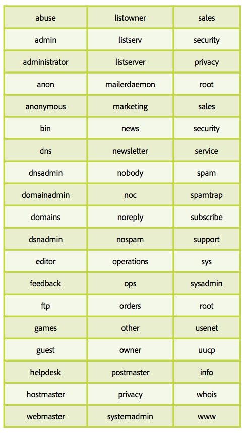

# 스팸 트랩에 대한 모든 정보

[스팸 트랩](/help/metrics/spam-traps.md)은 이메일을 보낼 때 오류 메시지가 없는 유효한 주소입니다. 스팸의 함정은 주된 임무다. 데이터 위생 프로세스 없이 발신자 또는 발신자를 식별합니다.

## 이러한 스팸 트랩 주소는 누가 관리합니까?

스팸트랩 주소의 첫 번째 유형은 SpamHaus, Sorbs, SpamCop와 같은 IP 및 차단 목록에 추가하다 도메인 회사입니다. 이 회사들은 많은 주소 네트워크를 가지고 있는데, 이 네트워크들은 웹 사이트, 블로그, 포럼과 같은 다양한 인터넷 페이지에 발송되어 그들의 주소가 스팸들에 의해 수집된다.

두 번째 유형의 스팸 트랩은 이전 활성 ISP 주소를 기반으로 합니다. 이러한 ISP는 트랩에서 재변환된 비활성 주소에 내장된 자체 스팸 트랩 네트워크를 가지고 있으며, 각 히트가 보낸 IP 및 도메인 평판에 영향을 줍니다.

## 어떻게 작동합니까?

**최종 사용자가 없는 이메일 주소**: 이러한 주소에는 뉴스레터 또는 기타 유형의 통신에 등록할 수 있는 최종 사용자가 없으며 이러한 주소는 없습니다.

**사용자가 포기한 이메일 주소**: 비활성 기간 이후에는 ISP에서 주소를 비활성화합니다. 바운스 메시지는 보낸 사람에게 전송되어 이 새 상태에 대해 알려줍니다. 보낸 사람은 이 주소를 격리하거나 향후 통신에서 제거해야 합니다. ISP는 &#39;스팸 트랩&#39;으로 변환되는 이 주소를 사용하여 보낸 사람을 나쁜 방식으로 모니터링합니다.

## 스팸 트랩을 인식하거나 식별하는 방법

스팸 트랩을 식별하기 어려운 작업입니다. 이러한 주소는 잘못된 보낸 사람을 식별하는 데 사용되므로 익명 상태여야 합니다. 대부분의 ISP에 열려 있지 않고 시스템을 클릭하여 잘못된 보낸 사람 히트를 모니터링합니다. 앞서 설명한 바와 같이 의심스러운 위치의 pod를 결정하고 pod의 선택 효율을 테스트할 수 있다.

## 데이터베이스가 스팸 트랩에 감염된 이유는 무엇입니까?

이메일 주소 데이터베이스에 스팸 트랩이 포함되어 있습니다. 어떻게 할 수 있습니까? 두 가지 주요 이유는 데이터베이스 위생 과정이 부족하거나 기능장애를 수집하는 것입니다.

이러한 몇 가지 사항은 프로세스를 확인하는 데 도움이 됩니다.

* 기능 수집:
   * 이메일 주소는 어디에서 비롯됩니까? 이러한 주소를 수집하는 데 사용되는 소스는 몇 개입니까? 신원을 확인할 수 있나요? 내부/상관 관계?
   * 옵트인 시스템이 제대로 작동합니까?
   * 주소의 도메인과 별칭을 확인했습니까? 아래 테이블로 하세요!
* 데이터베이스 위생 프로세스:
   * 지난 12개월 동안 비활성 주소에 대한 프로세스는 무엇입니까?
   * 소프트 바운스에서 격리를 &#39;비활성 사용자&#39;로 처리하고 있습니까?
   * 마지막으로 데이터베이스를 관리하고 정리하려고 한 것은 언제입니까? 규칙적으로 하세요.

## 방지할 별칭 및 도메인

**별칭**

**도메인**

