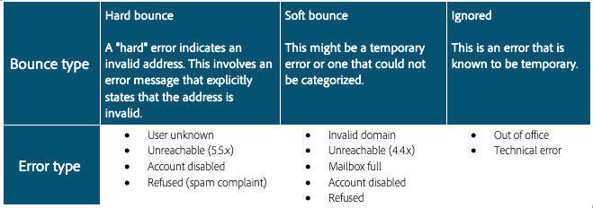

# 바운스 수

바운스 수는 ISP가 백 실패 알림을 제공하는 게재 시도 및 실패의 결과입니다. 바운스 처리 프로세싱은 목록 안전 상태의 중요한 부분입니다. 지정된 이메일이 여러 번 연속적으로 반송된 후 이 프로세스는 해당 이메일에 대해 오류 플래그를 지정합니다. 오류를 트리거하는 데 필요한 바운스 수와 유형은 시스템마다 다릅니다. 이 프로세스를 수행하면 시스템이 잘못된 이메일 주소를 계속 보내지 못합니다 바운스 수는 ISP가 IP 평판을 확인하는 데 사용하는 주요 데이터 중 하나입니다. 이 지표를 주시해야 합니다. &quot;전달됨&quot;과 &quot;바운스됨&quot;은 마케팅 메시지 전달을 측정하는 가장 일반적인 방법입니다. 전달률이 높을수록 좋습니다.

두 가지 다른 종류의 바운스를 알아보겠습니다.

## 하드 바운스

하드 바운스는 ISP에서 전달할 수 없는 구독자 주소에 대한 메일링 시도를 결정한 후 생성된 영구적인 실패입니다. Adobe Campaign 내에서 하드 바운스는 전달할 수 없는 것으로 분류되어 격리로 추가되므로 다시 시도하지 않습니다. 실패 원인을 알 수 없는 경우 하드 바운스가 무시되는 경우가 있습니다.
하드 바운스의 일반적인 예는 다음과 같습니다.

* 주소가 존재하지 않음
* 사용하지 않는 계정
* 잘못된 구문
* 잘못된 도메인

## 소프트 바운스

소프트 바운스는 ISP가 메일을 전달하기 어려울 때 생성하는 일시적인 실패입니다. 소프트 실패는 성공적인 전달을 시도하기 위해 여러 번(사용자 지정 또는 기본 전달 설정의 사용에 따라 달라짐) 다시 시도합니다. 소프트 바운스가 지속적인 주소는 최대 재시도 횟수가 시도될 때까지(설정에 따라 다시 달라짐) 격리에 추가되지 않습니다. 소프트 바운스의 몇 가지 일반적인 원인은 다음과 같습니다.

* 사서함이 가득 참
* 이메일 서버 작동 중지 수신 중
* 보낸 사람의 신뢰도 문제

>[!NOTE]
>
>바운스 수는 잘못된 데이터 소스(하드 바운스)나 ISP(소프트 바운스)의 신뢰도 문제를 강조 표시할 수 있으므로 신뢰도 문제를 나타내는 핵심 지표입니다.
>
>소프트 바운스는 종종 이메일 전송에서 발생하며, 실제 전달성 문제로 간주하기 전에 다시 시도 프로세싱에서 해결할 수 있어야 합니다. 소프트 바운스 비율이 단일 ISP의 경우 30% 이상이고 24시간 이내에 해결되지 않는 경우 Adobe Campaign 전달성 컨설턴트에게 문제를 문의하는 것이 좋습니다.

## 제품별 리소스

**Adobe Campaign Classic**

* [게재 실패 유형 및 이유](https://experienceleague.adobe.com/docs/campaign-classic/using/sending-messages/monitoring-deliveries/understanding-delivery-failures.html?lang=ko#delivery-failure-types-and-reasons)
* [바운스 메일 관리](https://experienceleague.adobe.com/docs/campaign-classic/using/sending-messages/monitoring-deliveries/understanding-delivery-failures.html?lang=ko#bounce-mail-management)
* [게재 불가 및 바운스 보고서](https://experienceleague.adobe.com/docs/campaign-classic/using/reporting/reports-on-deliveries/global-reports.html?lang=ko#non-deliverables-and-bounces)

**Adobe Campaign Standard**

* [게재 실패 유형 및 이유](https://experienceleague.adobe.com/docs/campaign-standard/using/testing-and-sending/monitoring-messages/understanding-delivery-failures.html?lang=ko#delivery-failure-types-and-reasons)
* [바운스 메일 조건](https://experienceleague.adobe.com/docs/campaign-standard/using/testing-and-sending/monitoring-messages/understanding-delivery-failures.html?lang=ko#bounce-mail-qualification)
* [바운스 요약 보고서](https://experienceleague.adobe.com/docs/campaign-standard/using/reporting/list-of-reports/bounce-summary.html?lang=ko#reporting)
