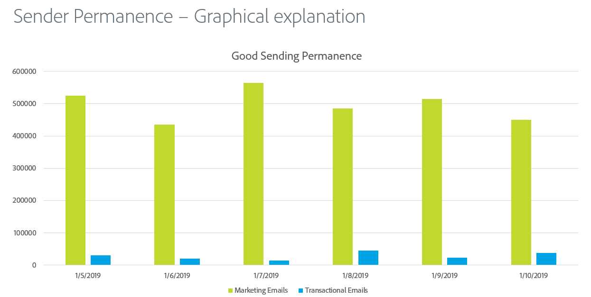

# 보낸 사람 영구성

전송 지속성은 ISP 평판을 유지하기 위해 일관된 전송 볼륨 및 전략을 설정하는 프로세스입니다. 발신자 영구성이 중요한 몇 가지 이유는 다음과 같습니다.

* 스팸머는 일반적으로 &quot;IP 주소 홉&quot;으로, 이는 평판 문제를 방지하기 위해 많은 IP 주소에서 트래픽을 지속적으로 이동함을 의미합니다.
* 일관성은 ISP에게 보낸 사람이 신뢰할 수 있고 잘못된 전송 방침으로 인해 발생하는 신뢰도 문제를 우회하려고 시도하지 않는다는 것을 입증하는 데 중요합니다.
* 일부 ISP가 발신자의 신뢰도를 조금이라도 고려하기 위해서는 이러한 일관된 전략을 장기간에 걸쳐 유지하는 것이 필요합니다.

**몇 가지 예제는 다음과 같습니다.**

