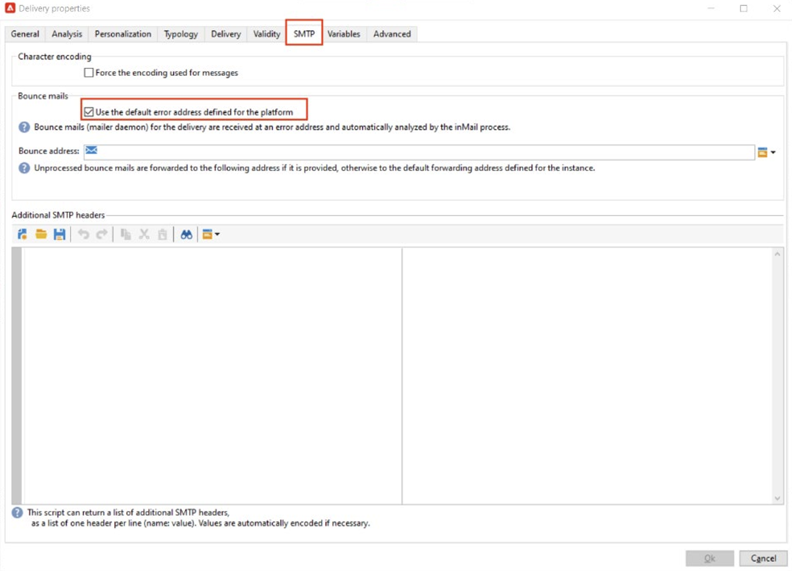
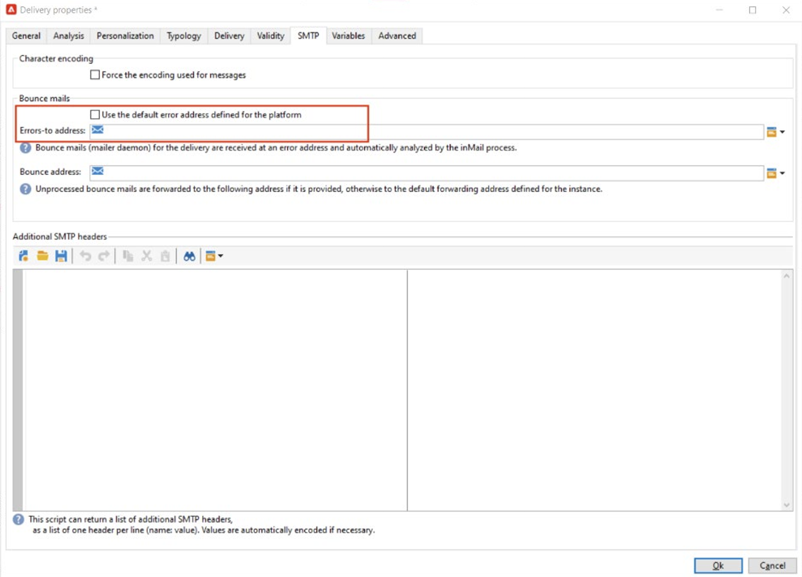

# [!DNL Domain-based Message Authentication, Reporting and Conformance] 구현(DMARC)

이 문서의 목적은 독자에게 이메일 인증 방법인 DMARC에 대한 추가 정보를 제공하는 것입니다. DMARC의 작동 방식과 다양한 정책 옵션을 설명함으로써, 독자는 DMARC이 이메일 전달성에 미치는 영향을 더 잘 이해할 수 있습니다.

## DMARC란? {#about}

Domain-based Message Authentication, Reporting and Conformance은 도메인 소유자가 도메인을 무단 사용으로부터 보호할 수 있는 이메일 인증 방법입니다. 또한 DMARC에서는 이메일 인증 상태에 대한 피드백을 제공하고 발신자가 인증에 실패한 이메일에 대한 상황을 제어할 수 있습니다. 여기에는 구현된 DMARC 정책에 따라 메일을 모니터링, 격리 또는 거부하는 옵션이 포함됩니다.

DMARC에는 세 가지 정책 옵션이 있습니다.

* **모니터(p=none):** 사서함 공급자/ISP가 메시지에 대해 일반적으로 수행하는 작업을 수행하도록 지시합니다.
* **격리(p=격리):** 사서함 공급자/ISP에 DMARC을 전달하지 않는 메일을 받는 사람의 스팸 또는 정크 폴더로 배달하도록 지시합니다.
* **거부(p=거부):** 사서함 공급자/ISP에 DMARC을 전달하지 않아 바운스가 발생하는 메일을 차단하도록 지시합니다.

## DMARC은 어떻게 작동합니까? {#how}

SPF와 DKIM은 모두 이메일을 도메인과 연결하고 이메일을 인증하기 위해 함께 작동하는 데 사용됩니다. DMARC은 이 단계를 한 단계 더 발전시켰으며 DKIM 및 SPF에서 확인한 도메인을 일치시켜 스푸핑을 방지하는 데 도움이 됩니다. DMARC을 전달하려면 메시지가 SPF 또는 DKIM을 전달해야 합니다. 이 두 가지 인증이 모두 실패하면 DMARC이 실패하고 선택한 DMARC 정책에 따라 이메일이 전달됩니다.

>[!NOTE]
>
>DMARC의 경우 &#39;From&#39; 주소와 &#39;Return-Path&#39; 주소 간에 조정이 필요합니다.

## DMARC을 구현해야 하는 이유는 무엇입니까? {#why}

DMARC은 선택 사항이며, 필수는 아니지만 무료이며, 이메일 수신자가 이메일 인증을 쉽게 식별할 수 있도록 하여 게재를 잠재적으로 개선할 수 있습니다. DMARC의 주요 이점 중 하나는 SPF 및/또는 DKIM에 실패한 메시지에 대한 보고를 제공한다는 것입니다. 또한 발신자에게 이러한 인증 방법 중 하나를 전달하지 않는 메일에 어떤 일이 발생하는지 어느 정도 제어할 수 있도록 합니다. 보낸 사람은 DMARC 보고를 통해 DMARC에 오류가 발생하는 메시지를 볼 수 있으므로 오류를 줄이기 위한 조치를 취할 수 있습니다.

>[!NOTE]
>
>BIMI를 구현하려면 p=격리 또는 p=거부 DMARC 정책이 필요합니다.

## DMARC 구현 우수 사례 {#best-practice}

DMARC은 선택 사항이므로 기본적으로 모든 ESP의 플랫폼에서 구성되지 않습니다. 도메인이 작동하려면 DNS에 DMARC 레코드를 만들어야 합니다. 또한 조직 내에서 DMARC 보고서가 이동해야 하는 위치를 나타내려면 선택한 전자 메일 주소가 필요합니다. 가장 좋은 방법은 다음과 같습니다
DMARC의 잠재적 영향에 대한 DMARC의 이해를 얻으면 DMARC 정책을 p=none에서 p=quarantine, p=reject로 승격하여 DMARC 구현을 천천히 롤아웃하는 것이 좋습니다.

1. 받아서 사용하는 피드백을 분석합니다(p=none). 이렇게 하면 수신자는 인증에 실패하는 메시지에 대해 작업을 수행하지 않지만 이메일 보고서를 보낸 사람에게 계속 전송합니다. 또한 합법적인 메시지가 인증에 실패한 경우 SPF/DKIM 문제를 검토하고 수정합니다.
1. SPF 및 DKIM이 정렬되어 모든 합법적인 이메일에 대한 인증을 전달하는지 확인한 다음, 정책을 (p=quarantine)으로 이동하여 수신 이메일 서버에서 인증에 실패한 이메일을 격리합니다(일반적으로 해당 메시지를 스팸 폴더에 배치함).
1. 정책을 (p=reject)로 조정합니다. p= reject 정책은 수신자에게 인증에 실패한 도메인에 대한 모든 이메일을 완전히 거부(바운스)하도록 지시합니다. 이 정책을 활성화하면 도메인에서 100% 인증된 것으로 확인된 이메일만 받은 편지함에 배치될 수 있습니다.

   >[!NOTE]
   >
   >이 정책을 신중하게 사용하고 조직에 적합한지 확인하십시오.

## DMARC 보고 {#reporting}

DMARC은 SPF/DKIM에 실패한 이메일에 대한 보고서를 받는 기능을 제공합니다. ISP 서비스가 보낸 사람이 DMARC 정책에서 RUA/RUF 태그를 통해 받을 수 있는 인증 프로세스의 일부로 생성하는 두 가지 다른 보고서가 있습니다.

* **집계 보고서(RUA):**&#x200B;에 GDPR에 민감한 PII(개인 식별 정보)가 포함되어 있지 않습니다.
* **포렌식 보고서(RUF):**&#x200B;에 GDPR에 민감한 전자 메일 주소가 있습니다. 활용하기 전에 GDPR 준수가 필요한 정보를 처리하는 방법을 내부적으로 확인하는 것이 가장 좋습니다.

이러한 보고서의 주요 용도는 스푸핑이 시도되는 이메일의 개요를 수신하는 것입니다. 타사 도구를 통해 가장 잘 요약되는 고도의 기술 보고서입니다. DMARC 모니터링을 전문으로 하는 몇 가지 회사는 다음과 같습니다.

* [ValiMail](https://www.valimail.com/products/#automated-delivery)
* [아가리](https://www.agari.com/)
* [드마르키안](https://dmarcian.com/)
* [Proofpoint](https://www.proofpoint.com/us)

>[!CAUTION]
>
>보고서를 받기 위해 추가하려는 이메일 주소가 DMARC 레코드가 생성된 도메인 외부에 있는 경우 해당 외부 도메인에 이 도메인을 소유하는 DNS를 지정하도록 승인해야 합니다. 이렇게 하려면 [dmarc.org 설명서](https://dmarc.org/2015/08/receiving-dmarc-reports-outside-your-domain)에 설명된 단계를 수행합니다.

### DMARC 레코드 예 {#example}

```
v=DMARC1; p=reject; fo=1; rua=mailto:dmarc_rua@emaildefense.proofpoint.com;ruf=mailto:dmarc_ruf@emaildefense.proofpoint.co
```

## DMARC 태그 및 작업 {#tags}

DMARC 레코드에는 DMARC 태그라는 여러 구성 요소가 있습니다. 각 태그에는 DMARC의 특정 측면을 지정하는 값이 있습니다.

| 태그 이름 | 필수/선택 사항 | 함수 | 예 | 기본 값 |
|  ---  |  ---  |  ---  |  ---  |  ---  |
| v | 필수 여부 | 이 DMARC 태그는 버전을 지정합니다. 현재 버전은 하나만 있으므로 v=DMARC1이라는 고정 값이 있습니다. | V=DMARC1 DMARC1 | DMARC |
| p | 필수 여부 | 선택한 DMARC 정책을 표시하고 수신자에게 인증 검사에 실패한 메일을 보고, 격리 또는 거부하도록 안내합니다. | p=none, 격리 또는 거부 | - |
| fo | 선택 사항입니다 | 도메인 소유자가 보고 옵션을 지정할 수 있도록 허용합니다. | 0: 모든 항목이 실패하면 보고서 생성<br/>1: 모든 항목이 실패하면 보고서 생성<br/>d: DKIM이 실패하면 보고서 생성<br/>s: SPF가 실패하면 보고서 생성 | 1(DMARC 보고서에 권장) |
| pct | 선택 사항입니다 | 필터링 대상 메시지의 비율을 알려줍니다. | pct=20 | 100 |
| rua | 선택 사항(권장) | 집계 보고서가 배달될 위치를 식별합니다. | `rua=mailto:aggrep@example.com` | - |
| 러프 | 선택 사항(권장) | 법의학 보고서가 배달될 위치를 식별합니다. | `ruf=mailto:authfail@example.com` | - |
| sp | 선택 사항입니다 | 상위 도메인의 하위 도메인에 대한 DMARC 정책을 지정합니다. | sp=reject | - |
| 광고 | 선택 사항입니다 | Strict(s) 또는 Relaxed(r)일 수 있습니다. 느슨한 정렬은 DKIM 서명에 사용된 도메인이 &quot;보낸 사람&quot; 주소의 하위 도메인일 수 있음을 의미합니다. 엄격한 정렬은 DKIM 서명에 사용된 도메인이 보낸 사람 주소에 사용된 도메인과 정확히 일치해야 함을 의미합니다. | adkim=r | r |
| aspf | 선택 사항입니다 | Strict(s) 또는 Relaxed(r)일 수 있습니다. 느슨한 정렬은 ReturnPath 도메인이 보낸 사람 주소의 하위 도메인일 수 있음을 의미합니다. 엄격한 정렬은 Return-Path 도메인이 From 주소와 정확히 일치해야 함을 의미합니다. | aspf=r | r |

## DMARC 및 Adobe Campaign {#campaign}

>[!NOTE]
>
>Campaign 인스턴스가 AWS에서 호스팅되는 경우 Campaign 컨트롤 패널을 사용하여 하위 도메인용 DMARC을 구현할 수 있습니다. [Campaign 컨트롤 패널을 사용하여 DMARC 레코드를 구현하는 방법을 알아봅니다](https://experienceleague.adobe.com/docs/control-panel/using/subdomains-and-certificates/txt-records/dmarc.html).

DMARC 실패의 일반적인 이유는 &#39;시작&#39; 주소와 &#39;오류 - 종료&#39; 또는 &#39;반환 경로&#39; 주소 간의 오정렬입니다. 이를 방지하려면 DMARC을 설정할 때 게재 템플릿에서 &#39;보낸 사람&#39; 및 &#39;오류 발송 대상&#39; 주소 설정을 다시 확인하는 것이 좋습니다.

1. 게재 템플릿에서 현재 &#39;보낸 사람&#39; 주소로 설정된 주소를 검토합니다.

   

1. 여기에서 게재 템플릿을 추가로 편집할 수 있는 &#39;속성&#39;을 선택합니다. 이 창에서 SMTP를 선택하고 선택한 경우 &quot;플랫폼에 대해 정의된 기본 오류 주소 사용&quot;의 선택을 취소합니다. Adobe Campaign의 게재 템플릿은 기본적으로 이 확인란을 선택합니다. 기본 오류 주소는 이 게재 템플릿의 보낸 사람 주소와 연결된 주소가 아닐 수 있습니다.

   

1. 이 상자를 선택 취소하면 보낸 사람 주소에 설정된 것과 동일한 도메인을 사용하는 고유한 오류 주소를 입력할 수 있는 텍스트 필드가 나타납니다.

   

이러한 변경 사항이 저장되면 올바른 도메인 맞춤으로 DMARC 구현을 진행할 수 있습니다.

## 유용한 링크 {#links}

* [DMARC.org](https://dmarc.org/){target="_blank"}
* [M3AAWG 이메일 인증](https://www.m3aawg.org/sites/default/files/document/M3AAWG_Email_Authentication_Update-2015.pdf){target="_blank"}
